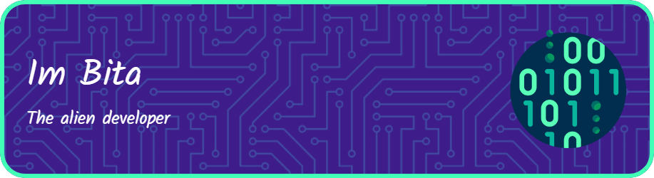

## 👾 01110111 01100101 01101100 01100011 01101111 01101101 01100101 (´∇｀ )👋 👾 
# 
 - 🎃 Im just a noob programmer with big dreams about Ai 🎧🎮🍕📓
 - 🔵 back-end 🌒 > front-end 🌖
 - 🐍 Python + AI 🧠
 - 🧬 intrested in AI , robotics and Game developing 🦾
 - 💻 CS degree 🎓

 - 
 # 🍥 developing and learning :
 # 

 ## Reach me --> ✉ : Bitahua@gmail.com  
 # 
 

 
 
<!--
**Bita404/Bita404** is a ✨ _special_ ✨ repository because its `README.md` (this file) appears on your GitHub profile.

Here are some ideas to get you started:

- 🔭 I’m currently working on ...
- 🌱 I’m currently learning ...
- 👯 I’m looking to collaborate on ...
- 🤔 I’m looking for help with ...
- 💬 Ask me about ...
- 📫 How to reach me: ...
- 😄 Pronouns: ...
- ⚡ Fun fact: ...
-->
