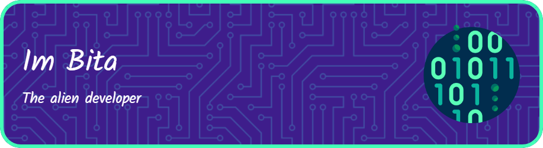

## 👾 01001000 01100101 01101100 01110000 (´∇｀ )👋 👾 

<table>
  <tr>
    <td>
      <ul>
        <li>🎃 I'm just a noob programmer with big dreams about AI 🎧🎮🍕📓</li>
        <li>💻 CS degree 🎓</li>
        <li> :satellite: Doing Master's in Computer Networks :earth_americas: </li>
        <li>🐍 Python + ML + NN + deep 🧠</li>
        <li>🔵 Back-end 🌒 > </li>
        <li>🧬 Interested in AI, robotics and game developing 🦾</li>
        <li>🤖Clanker friendly :sparkles: </li>
        <li>oh did I mention AI ??? </li>
      </ul>
    </td>
    <td>
      
    </td>
  </tr>
</table>

 # 🍥 developing and learning :
 # 

 ## Reach me --> ✉ : Bitahua@gmail.com  
 

 
 
<!--
**Bita404/Bita404** is a ✨ _special_ ✨ repository because its `README.md` (this file) appears on your GitHub profile.

Here are some ideas to get you started:

- 🔭 I’m currently working on ...
- 🌱 I’m currently learning ...
- 👯 I’m looking to collaborate on ...
- 🤔 I’m looking for help with ...
- 💬 Ask me about ...
- 📫 How to reach me: ...
- 😄 Pronouns: ...
- ⚡ Fun fact: ...
-->
